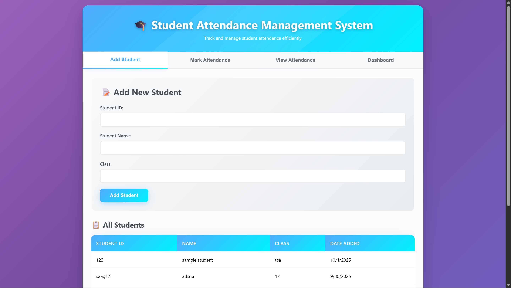
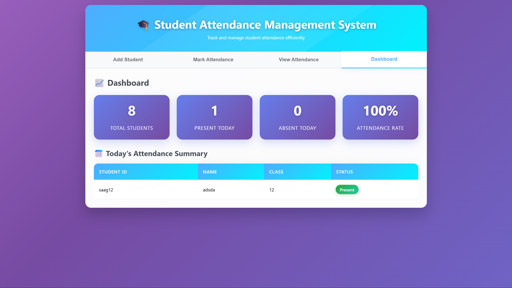
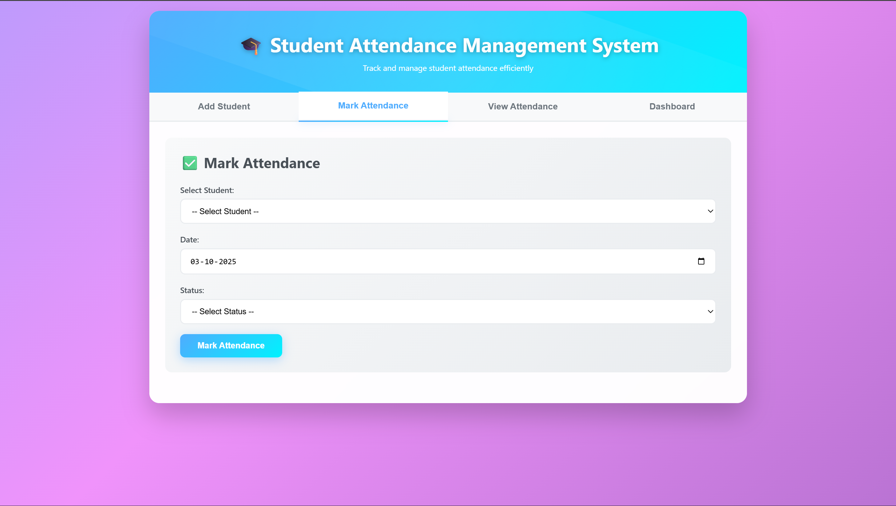
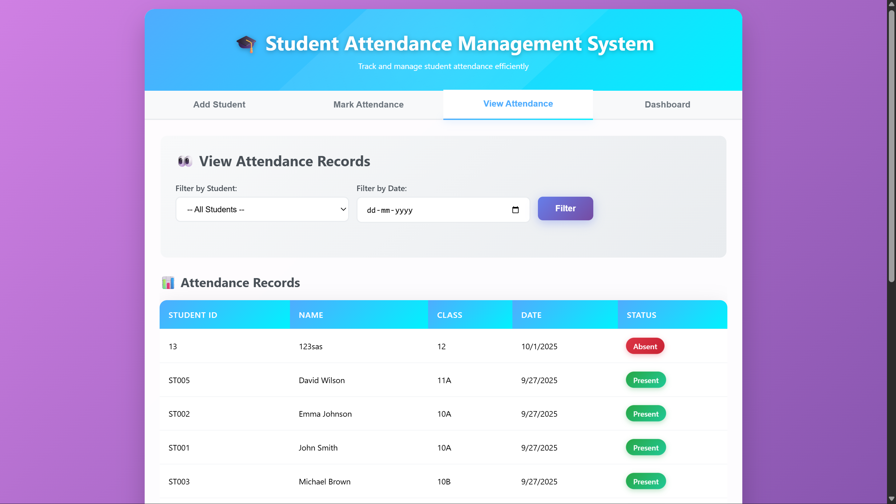

# 🎓 Student Attendance Management System

[](https://github.com/Sagardevil/student-attendance-management/stargazers)
[](https://github.com/Sagardevil/student-attendance-management/network)
[](https://github.com/Sagardevil/student-attendance-management/issues)
[](https://github.com/Sagardevil/student-attendance-management/blob/main/LICENSE)

A comprehensive web-based Student Attendance Management System designed to streamline attendance tracking in educational institutions. This system provides an efficient solution for managing student attendance records with role-based access for administrators, teachers, and students.

## 📸 Project Outputs

| Main Page                           | Dashboard                           |
| ----------------------------------- | ----------------------------------- |
|  |  |

| Mark Attendance                                 | View Attendance                                 |
| ----------------------------------------------- | ----------------------------------------------- |
|  |  |

---

## 🌟 Features

### 👨‍💼 Admin Panel

- **User Management**: Create, update, and manage teacher and student accounts
- **Class Management**: Organize classes, sections, and subjects
- **Attendance Reports**: Generate comprehensive attendance reports
- **Dashboard Analytics**: View attendance statistics and trends
- **System Configuration**: Manage system settings and configurations

### 👩‍🏫 Teacher Panel

- **Mark Attendance**: Easy attendance marking interface for classes
- **Class Management**: View assigned classes and student lists
- **Attendance Reports**: Generate reports for specific classes and time periods
- **Student Profiles**: Access student information and attendance history
- **Quick Actions**: Bulk attendance operations and corrections

### 👨‍🎓 Student Panel

- **View Attendance**: Check personal attendance records
- **Attendance Summary**: Monthly and semester-wise attendance overview
- **Class Schedule**: View class timetables and subjects
- **Notifications**: Receive attendance-related alerts and updates
- **Profile Management**: Update personal information

## 🛠️ Technology Stack

- **Frontend**: HTML5, CSS3, JavaScript, Bootstrap
- **Backend**: PHP
- **Database**: MySQL
- **Authentication**: Session-based authentication system
- **Charts**: Chart.js for data visualization

## 📋 Prerequisites

Before running this application, ensure you have the following installed:

- **Web Server**: Apache/Nginx
- **PHP**: Version 7.4 or higher
- **Database**: MySQL 5.7 or higher
- **Browser**: Modern web browser (Chrome, Firefox, Safari, Edge)

## 🚀 Installation

### Step 1: Clone the Repository

```bash
git clone https://github.com/Sagardevil/student-attendance-management.git
cd student-attendance-management
```

### Step 2: Database Setup

1. Create a new MySQL database:

```sql
CREATE DATABASE attendance_system;
```

2. Import the database schema:

```bash
mysql -u username -p attendance_system < database/attendance_system.sql
```

3. Update database configuration in `config/database.php`:

```php
<?php
$servername = "localhost";
$username = "your_username";
$password = "your_password";
$dbname = "attendance_system";
?>
```

### Step 3: Configure Web Server

1. Place the project files in your web server directory (e.g., `htdocs` for XAMPP)
2. Ensure the web server has read/write permissions for the application directory

### Step 4: Initial Setup

1. Access the application in your browser: `http://localhost/student-attendance-management`
2. Use default admin credentials:
   - **Username**: admin
   - **Password**: admin123
3. Change the default password after first login

## 📁 Project Structure

```
student-attendance-management/
├── admin/                  # Admin panel files
│   ├── dashboard.php
│   ├── manage-users.php
│   ├── reports.php
│   └── ...
├── teacher/               # Teacher panel files
│   ├── dashboard.php
│   ├── mark-attendance.php
│   ├── view-attendance.php
│   └── ...
├── student/               # Student panel files
│   ├── dashboard.php
│   ├── view-attendance.php
│   └── ...
├── assets/                # Static assets
│   ├── css/
│   ├── js/
│   └── images/
├── config/                # Configuration files
│   ├── database.php
│   └── config.php
├── includes/              # Common includes
│   ├── header.php
│   ├── footer.php
│   └── functions.php
├── database/              # Database files
│   └── attendance_system.sql
├── uploads/               # File uploads directory
├── index.php             # Main entry point
└── README.md
```

## 🔧 Configuration

### Environment Configuration

Create a `.env` file in the root directory:

```env
DB_HOST=localhost
DB_USERNAME=your_username
DB_PASSWORD=your_password
DB_NAME=attendance_system
APP_URL=http://localhost/student-attendance-management
DEBUG_MODE=false
```

### Email Configuration (Optional)

Configure email settings in `config/email.php` for notifications:

```php
$email_config = [
    'smtp_host' => 'smtp.gmail.com',
    'smtp_port' => 587,
    'smtp_username' => 'your_email@gmail.com',
    'smtp_password' => 'your_app_password'
];
```

## 👥 User Roles & Permissions

| Role            | Permissions                                                  |
| --------------- | ------------------------------------------------------------ |
| **Super Admin** | Full system access, user management, system configuration    |
| **Admin**       | User management, reports generation, class management        |
| **Teacher**     | Mark attendance, view class reports, manage assigned classes |
| **Student**     | View personal attendance, class schedules, notifications     |

## 📊 Features Overview

### Attendance Marking

- Quick and intuitive interface for marking attendance
- Bulk operations for multiple students
- Late arrival and early departure tracking
- Attendance corrections and modifications

### Reporting System

- Daily, weekly, monthly, and custom date range reports
- Export reports in PDF and Excel formats
- Graphical representation of attendance data
- Defaulter lists and low attendance alerts

### Dashboard Analytics

- Real-time attendance statistics
- Class-wise attendance summaries
- Student performance metrics
- Visual charts and graphs

## 🔒 Security Features

- **Password Hashing**: Secure password storage using PHP password_hash()
- **SQL Injection Protection**: Prepared statements for database queries
- **Session Management**: Secure session handling and timeout
- **Access Control**: Role-based access control system
- **Input Validation**: Server-side validation for all user inputs

## 🎨 Customization

### Theme Customization

Modify `assets/css/custom.css` to change the appearance:

```css
:root {
  --primary-color: #007bff;
  --secondary-color: #6c757d;
  --success-color: #28a745;
  --danger-color: #dc3545;
}
```

### Adding New Features

1. Create new PHP files in the appropriate directory
2. Update navigation menus in `includes/header.php`
3. Add database tables if required
4. Update user permissions in `config/permissions.php`

## 📱 Mobile Responsiveness

The system is fully responsive and works seamlessly on:

- Desktop computers
- Tablets
- Mobile phones
- All modern browsers

## 🤝 Contributing

We welcome contributions! Please follow these steps:

1. Fork the repository
2. Create a feature branch: `git checkout -b feature/amazing-feature`
3. Commit your changes: `git commit -m 'Add amazing feature'`
4. Push to the branch: `git push origin feature/amazing-feature`
5. Open a Pull Request

### Development Guidelines

- Follow PSR-4 coding standards
- Write meaningful commit messages
- Add comments for complex logic
- Test thoroughly before submitting

## 🐛 Troubleshooting

### Common Issues

**Issue**: Database connection error
**Solution**: Check database credentials in `config/database.php`

**Issue**: Permission denied errors
**Solution**: Ensure proper file permissions (755 for directories, 644 for files)

**Issue**: Session timeout issues
**Solution**: Check PHP session configuration and server settings

**Issue**: Reports not generating
**Solution**: Verify write permissions for the `uploads/` directory

## 📄 License

This project is licensed under the MIT License - see the [LICENSE](LICENSE) file for details.

## 👨‍💻 Author

**Sagar Devil**

- GitHub: [@Sagardevil](https://github.com/Sagardevil)
- Email: [your.email@example.com](mailto:your.email@example.com)

## 🙏 Acknowledgments

- Thanks to all contributors who have helped improve this project
- Special thanks to the open-source community for inspiration
- Bootstrap team for the amazing CSS framework
- Chart.js team for the charting library

## 📞 Support

If you encounter any issues or have questions:

1. Check the [Issues](https://github.com/Sagardevil/student-attendance-management/issues) page
2. Create a new issue if your problem isn't already reported
3. Provide detailed information about your environment and the issue

## 🔄 Updates & Changelog

### Version 1.0.0

- Initial release with core functionality
- Admin, Teacher, and Student panels
- Basic reporting system
- Responsive design implementation

---

⭐ **Star this repository if you find it helpful!**

📢 **Follow for more educational projects and updates**

🤝 **Contributions and feedback are always welcome**
